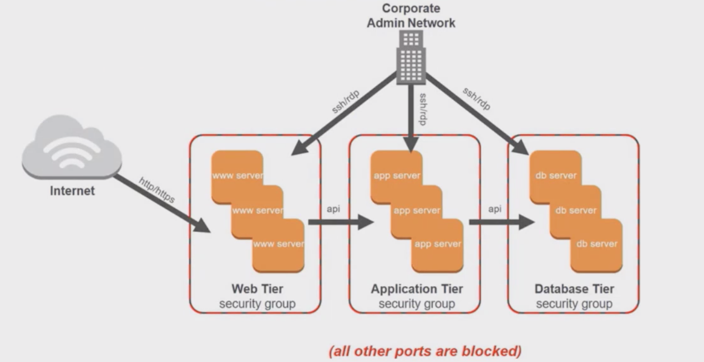

# AWS Security Groups

* **AWS Security Groups** act as *built in firewalls* for virtual servers
* AWS Security Groups *control accessability to instances*
* At a basic level, they are a method to *filter traffic to your instances*
* Traffic can be allowed or denied
* You can determine access to instances through a **Security Group Wall**, for example
* Rules can be set for totally private, totally public, or somewhere in between

